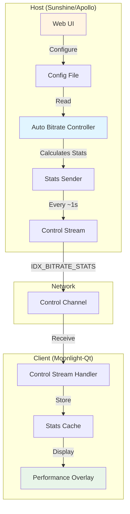
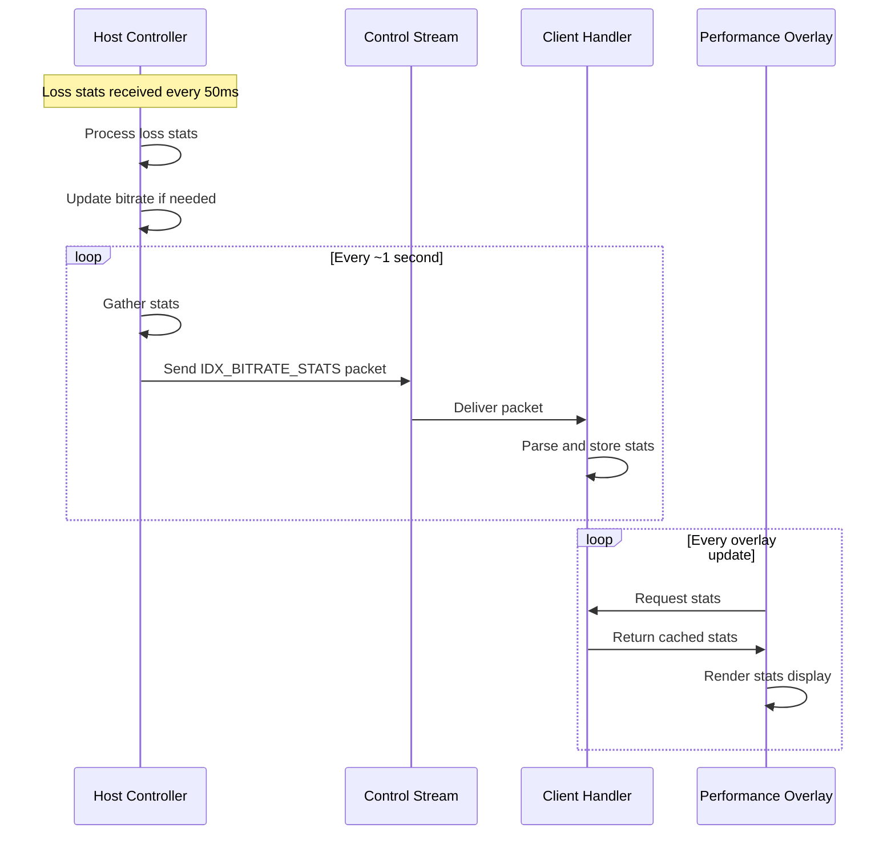
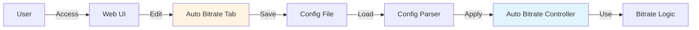
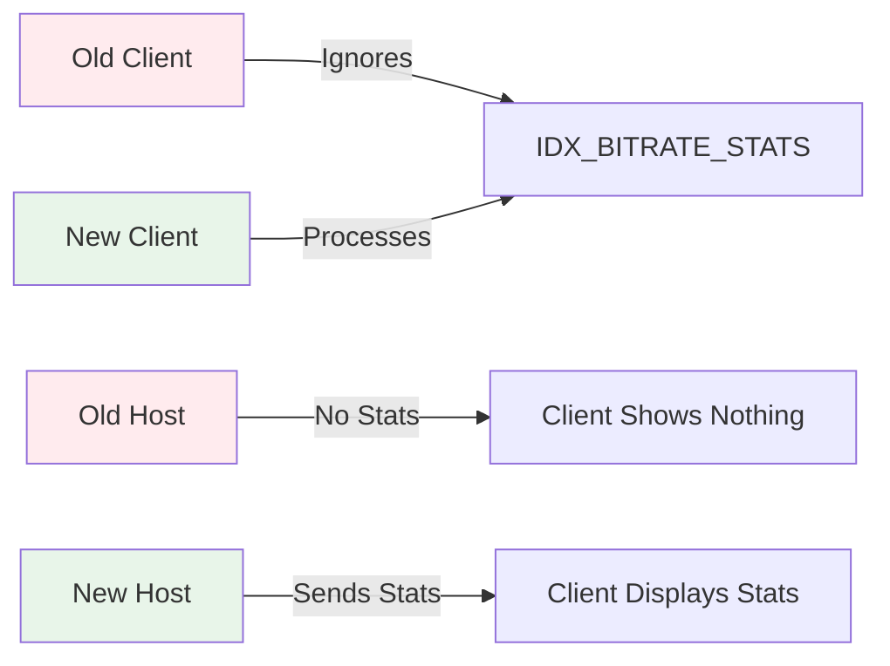

# Auto Bitrate Stats Display and Configuration UI Report

## Overview

This report documents the implementation of two complementary features for the dynamic bitrate adjustment system:

1. **Client-Side Stats Display**: Real-time visualization of auto bitrate statistics in Moonlight-Qt's performance overlay
2. **Host-Side Configuration UI**: Web-based configuration interface for tuning auto bitrate parameters

These features enhance the user experience by providing visibility into bitrate adjustments and allowing administrators to fine-tune the behavior of the dynamic bitrate system.

## Feature Summary

### Client-Side Stats Display

The client-side stats display shows real-time information about automatic bitrate adjustments directly in the performance overlay (accessible via `Ctrl+Alt+Shift+S` or `Select+L1+R1+X`). The display includes:

- **Current encoder bitrate**: The active bitrate after adjustments (in Kbps)
- **Frame loss percentage**: Current network frame loss as computed by the host
- **Last adjustment time**: When the most recent bitrate adjustment occurred
- **Total adjustments**: Cumulative count of bitrate adjustments made during the session

### Host-Side Configuration UI

A dedicated "Auto Bitrate" tab in Sunshine's web configuration interface (`https://localhost:47990`) provides three tuning parameters:

- **Minimum Bitrate**: Lower bound for bitrate adjustments (default: 500 Kbps)
- **Maximum Bitrate**: Upper bound for bitrate adjustments (default: 0 = use client max)
- **Adjustment Interval**: Minimum time between adjustments (default: 3000 ms)

## Architecture

### System Overview



### Stats Flow Diagram



### Configuration Flow



## Implementation Details

### Protocol Extension

#### Packet Type: IDX_BITRATE_STATS

**Packet ID**: `0x5504` (Sunshine protocol extension)  
**Index**: 20  
**Direction**: Host → Client  
**Frequency**: Every ~1 second (when auto bitrate enabled)  
**Encryption**: Encrypted via control stream (Gen7+)

**Packet Structure**:

```cpp
struct control_bitrate_stats_t {
    control_header_v2 header;
    uint32_t current_bitrate_kbps;      // Current encoder bitrate
    uint64_t last_adjustment_time_ms;   // Milliseconds since session start
    uint32_t adjustment_count;          // Total adjustments made
    float loss_percentage;              // Current frame loss percentage
};
```

**Payload Layout**:
- Bytes 0-3: `current_bitrate_kbps` (uint32_t, little-endian)
- Bytes 4-11: `last_adjustment_time_ms` (uint64_t, little-endian)
- Bytes 12-15: `adjustment_count` (uint32_t, little-endian)
- Bytes 16-19: `loss_percentage` (float, little-endian)

### Host-Side Implementation

#### Stats Collection

The host collects statistics from the `auto_bitrate_controller_t` instance:

**File**: `apollo/src/stream.cpp`

```cpp
int send_bitrate_stats(session_t *session) {
    uint32_t current_bitrate_kbps;
    uint64_t last_adjustment_time_ms;
    uint32_t adjustment_count;
    float loss_percentage;

    if (!auto_bitrate_controller.get_stats(session, 
                                            current_bitrate_kbps, 
                                            last_adjustment_time_ms, 
                                            adjustment_count, 
                                            loss_percentage)) {
        return -1;
    }
    // ... encode and send packet
}
```

**Stats are sent periodically**:
- Triggered every 20 loss stats packets (~1 second, since loss stats arrive every 50ms)
- Only sent when `session->auto_bitrate_enabled == true`
- Uses existing `encode_control()` infrastructure

#### Controller State Tracking

The controller maintains per-session state including:

- `current_bitrate_kbps`: Current encoder bitrate
- `adjustment_count`: Incremented on each adjustment
- `last_adjustment_time`: Timestamp of last adjustment
- `session_start_time`: Session start timestamp for relative time calculation
- `loss_percentage`: Computed frame loss percentage

**File**: `apollo/src/auto_bitrate.h`

```cpp
struct session_state_t {
    std::chrono::steady_clock::time_point session_start_time;
    std::chrono::steady_clock::time_point last_adjustment_time;
    int current_bitrate_kbps;
    uint32_t adjustment_count;
    double loss_percentage;
    // ... other fields
};
```

### Client-Side Implementation

#### Packet Reception

**File**: `moonlight-common-c/src/ControlStream.c`

The client receives and processes `IDX_BITRATE_STATS` packets:

```c
else if (ctlHdr->type == packetTypes[IDX_BITRATE_STATS]) {
    BYTE_BUFFER bb;
    uint32_t current_bitrate_kbps;
    uint64_t last_adjustment_time_ms;
    uint32_t adjustment_count;
    uint32_t loss_bits;
    float loss_percentage;

    BbInitializeWrappedBuffer(&bb, ...);
    BbGet32(&bb, &current_bitrate_kbps);
    BbGet64(&bb, &last_adjustment_time_ms);
    BbGet32(&bb, &adjustment_count);
    BbGet32(&bb, &loss_bits);
    memcpy(&loss_percentage, &loss_bits, sizeof(float));

    // Update global stats
    autoBitrateStats.current_bitrate_kbps = current_bitrate_kbps;
    autoBitrateStats.last_adjustment_time_ms = last_adjustment_time_ms;
    autoBitrateStats.adjustment_count = adjustment_count;
    autoBitrateStats.loss_percentage = loss_percentage;
    autoBitrateStats.enabled = true;
}
```

#### Stats Structure

**File**: `moonlight-common-c/src/Limelight.h`

```c
typedef struct _AUTO_BITRATE_STATS {
    uint32_t current_bitrate_kbps;
    uint64_t last_adjustment_time_ms;
    uint32_t adjustment_count;
    float loss_percentage;
    bool enabled;
} AUTO_BITRATE_STATS, *PAUTO_BITRATE_STATS;

const AUTO_BITRATE_STATS* LiGetAutoBitrateStats(void);
```

#### Overlay Display

**File**: `moonlight-qt/app/streaming/video/ffmpeg.cpp`

The performance overlay displays stats when available:

```cpp
const AUTO_BITRATE_STATS* autoBitrateStats = LiGetAutoBitrateStats();
if (autoBitrateStats != NULL && autoBitrateStats->enabled) {
    // Format last adjustment time
    char lastAdjustmentStr[64];
    if (autoBitrateStats->last_adjustment_time_ms > 0) {
        double adjustment_time_sec = 
            autoBitrateStats->last_adjustment_time_ms / 1000.0;
        // Format as "Recently", "Xs into session", or "Xmin into session"
    }
    
    // Display stats
    snprintf(&output[offset], length - offset,
        "\nAuto Bitrate:\n"
        "Current encoder bitrate: %u Kbps\n"
        "Frame loss: %.2f%%\n"
        "Last adjustment: %s\n"
        "Total adjustments: %u\n",
        autoBitrateStats->current_bitrate_kbps,
        autoBitrateStats->loss_percentage,
        lastAdjustmentStr,
        autoBitrateStats->adjustment_count);
}
```

### Configuration UI Implementation

#### Component Structure

**File**: `apollo/src_assets/common/assets/web/configs/tabs/AutoBitrate.vue`

The Vue component provides three input fields with validation:

```vue
<template>
  <div id="auto-bitrate" class="config-page">
    <!-- Minimum Bitrate -->
    <input type="number" v-model.number="config.auto_bitrate_min_kbps"
           min="500" step="100" @input="validateMinBitrate" />
    
    <!-- Maximum Bitrate -->
    <input type="number" v-model.number="config.auto_bitrate_max_kbps"
           min="0" step="1000" @input="validateMaxBitrate" />
    
    <!-- Adjustment Interval -->
    <input type="number" v-model.number="config.auto_bitrate_adjustment_interval_ms"
           min="1000" step="500" @input="validateAdjustmentInterval" />
  </div>
</template>
```

#### Validation Rules

- **Minimum Bitrate**: Must be ≥ 500 Kbps
- **Maximum Bitrate**: Must be 0 (use client max) or ≥ minimum bitrate
- **Adjustment Interval**: Must be ≥ 1000 ms

#### Configuration Storage

**File**: `apollo/src/config.cpp`

Configuration values are parsed from `sunshine.conf`:

```cpp
video.auto_bitrate_min_kbps = 
    util::from_view(config_file["video"]["auto_bitrate_min_kbps"], 500);
video.auto_bitrate_max_kbps = 
    util::from_view(config_file["video"]["auto_bitrate_max_kbps"], 0);
video.auto_bitrate_adjustment_interval_ms = 
    util::from_view(config_file["video"]["auto_bitrate_adjustment_interval_ms"], 3000);
```

**Configuration File Format** (`sunshine.conf`):

```ini
[video]
auto_bitrate_min_kbps = 500
auto_bitrate_max_kbps = 0
auto_bitrate_adjustment_interval_ms = 3000
```

## User Experience

### Client-Side Stats Display

#### Accessing the Stats

1. Start a streaming session with auto bitrate enabled (checkbox checked in Moonlight-Qt)
2. Press `Ctrl+Alt+Shift+S` (or `Select+L1+R1+X` on gamepad) to toggle performance overlay
3. The overlay displays standard streaming stats plus an "Auto Bitrate" section

#### Stats Display Format

```
Auto Bitrate:
Current encoder bitrate: 15000 Kbps
Frame loss: 2.5%
Last adjustment: 15s into session
Total adjustments: 3
```

#### Display Behavior

- **Only shown when enabled**: Stats appear only when auto bitrate is active
- **Real-time updates**: Stats refresh every ~1 second as new packets arrive
- **Graceful degradation**: If host doesn't send stats (old version), no error occurs
- **Time formatting**: Last adjustment time shown as "Recently" (< 5s), "Xs into session", or "Xmin into session"

### Host-Side Configuration

#### Accessing the Configuration

1. Open Sunshine web UI: `https://localhost:47990`
2. Navigate to **Configuration** → **Auto Bitrate** tab
3. Adjust parameters as needed
4. Click **Save** then **Apply**

#### Configuration Parameters

| Parameter | Default | Range | Description |
|-----------|---------|-------|-------------|
| Minimum Bitrate | 500 Kbps | ≥ 500 | Lower bound for bitrate adjustments |
| Maximum Bitrate | 0 (client max) | 0 or ≥ min | Upper bound (0 = use client's max) |
| Adjustment Interval | 3000 ms | ≥ 1000 | Minimum time between adjustments |

#### Recommended Settings

- **Stable networks**: Higher adjustment interval (5000-10000 ms), wider range
- **Unstable networks**: Lower adjustment interval (2000-3000 ms), narrower range
- **Bandwidth-limited**: Set maximum bitrate to available bandwidth
- **Quality-focused**: Set minimum bitrate higher (1000-2000 Kbps)

## Technical Considerations

### Backward Compatibility



**Client Compatibility**:
- Old clients ignore unknown packet types (`IDX_BITRATE_STATS`)
- No errors or crashes occur
- Stats simply don't display

**Host Compatibility**:
- Old hosts don't send stats packets
- Client detects `enabled == false` and hides stats section
- No impact on streaming functionality

### Performance Impact

#### Network Overhead

- **Packet size**: ~24 bytes payload + headers (~50 bytes total)
- **Frequency**: ~1 packet per second
- **Bandwidth**: ~400 bps (negligible)
- **Encryption**: Uses existing control stream encryption (no additional overhead)

#### CPU Impact

- **Host**: Minimal (stats already computed for adjustment logic)
- **Client**: Negligible (simple packet parsing and display formatting)

### Error Handling

#### Host-Side

- **Session not found**: Returns early, no packet sent
- **Auto bitrate disabled**: Returns early, no packet sent
- **Control peer unavailable**: Logs warning, returns error
- **Encoding failure**: Logs error, continues streaming

#### Client-Side

- **Invalid packet size**: Packet ignored, no crash
- **Missing stats**: `LiGetAutoBitrateStats()` returns `NULL`, overlay hides section
- **Malformed data**: Parsing fails gracefully, old stats retained

## Testing Recommendations

### Functional Testing

1. **Stats Display**:
   - Verify stats appear when auto bitrate enabled
   - Verify stats hidden when auto bitrate disabled
   - Verify stats update in real-time
   - Test with various loss scenarios

2. **Configuration UI**:
   - Test all three configuration options
   - Verify validation works correctly
   - Test saving and loading configuration
   - Verify defaults are applied correctly

3. **Integration**:
   - Test stats display during active streaming
   - Verify configuration changes take effect
   - Test with different protocol versions (Gen7, Gen7Enc)

### Edge Cases

1. **Rapid adjustments**: Verify stats update correctly during frequent adjustments
2. **Long sessions**: Verify time calculations remain accurate over extended periods
3. **Network interruptions**: Verify stats resume correctly after reconnection
4. **Configuration changes**: Verify changes apply to new sessions only (not active ones)

## Future Enhancements

### Potential Improvements

1. **Historical Graph**: Display bitrate over time as a graph
2. **Adjustment History**: Show list of recent adjustments with reasons
3. **Client-Side Loss Calculation**: Compute loss locally as backup/validation
4. **Advanced Configuration**: Per-session configuration overrides
5. **Statistics Export**: Export stats to file for analysis

### Protocol Enhancements

1. **Bidirectional Stats**: Client sends its own loss calculations for comparison
2. **Adjustment Reasons**: Include reason codes in stats (loss threshold, connection status, etc.)
3. **Quality Metrics**: Include additional metrics (latency, jitter, etc.)

## Conclusion

The auto bitrate stats display and configuration UI features provide essential visibility and control over the dynamic bitrate adjustment system. Users can now:

- **Monitor** bitrate adjustments in real-time
- **Understand** network conditions affecting their stream
- **Tune** the adjustment algorithm to their specific needs

The implementation is robust, backward-compatible, and has minimal performance impact. The features integrate seamlessly with the existing auto bitrate system and enhance the overall streaming experience.

## References

- **Dynamic Bitrate Implementation Report**: `DYNAMIC_BITRATE_IMPLEMENTATION_REPORT.md`
- **Bitrate Handling Report**: `BITRATE_HANDLING_REPORT.md`
- **Auto Bitrate Validation Report**: `AUTO_BITRATE_VALIDATION_REPORT.md`

## Appendix: Code Locations

### Host-Side Files

- `apollo/src/stream.cpp`: Packet type definition, stats sending logic
- `apollo/src/auto_bitrate.h`: Controller interface with `get_stats()` method
- `apollo/src/auto_bitrate.cpp`: Stats collection implementation
- `apollo/src/config.h`: Configuration structure definitions
- `apollo/src/config.cpp`: Configuration parsing
- `apollo/src_assets/common/assets/web/configs/tabs/AutoBitrate.vue`: UI component
- `apollo/src_assets/common/assets/web/config.html`: Tab registration
- `apollo/src_assets/common/assets/web/public/assets/locale/en.json`: Localization strings

### Client-Side Files

- `moonlight-common-c/src/ControlStream.c`: Packet handler implementation
- `moonlight-common-c/src/Limelight.h`: Stats structure and API
- `moonlight-qt/app/streaming/video/ffmpeg.cpp`: Overlay display implementation

